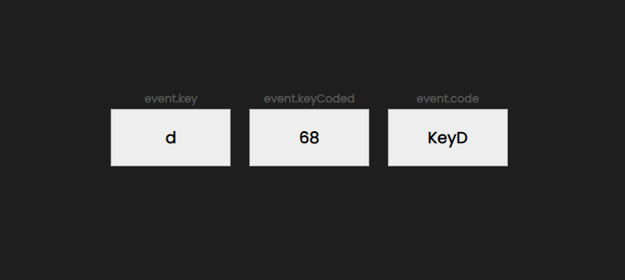

# Event Key Codes Project

## 1. Project Description 😆

Build a clone of a Event Key Codes using HTML, CSS and Javascript.
This is a small project about event key codes.

## 2. Tech Stack 😎

1. >HTML
2. >CSS
3. >Javascript

## 3. Installing 😉

```link
https://github.com/VoDuyThienVinh/EventKeyCodes
```

1. Clone the repo [Event KeyCodes](https://github.com/VoDuyThienVinh/EventKeyCodes)
2. Open project folder
3. Explore
4. Open index.html in Visual Studio Code, using Live Server
5. Press any button on the keyboard
6. Enjoy 😍

## 4. Screenshots 😂



## 5. Link Github-Page 😁

[EventKeyCodes](https://voduythienvinh.github.io/EventKeyCodes/)

```link
https://voduythienvinh.github.io/EventKeyCodes/
```

## Adapted From: 😉

Udemy Course: 50 Project in 50 Days - HTML, CSS & Javascript
Project Name: Day 11 - Event Key Codes
Create by: Brad Traversy, Florin Pop
Last updated 12/2020
URL: <https://www.udemy.com/course/50-projects-50-days/>
